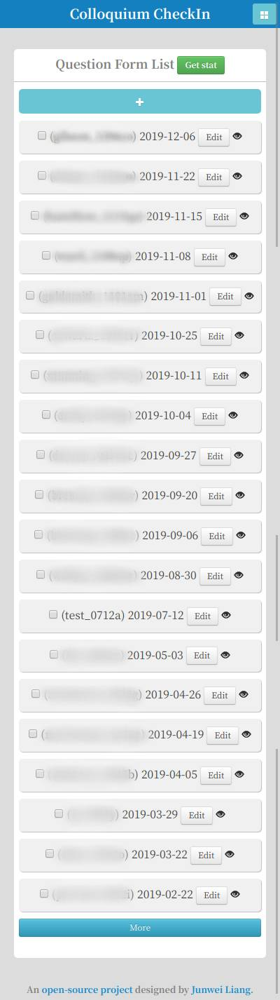
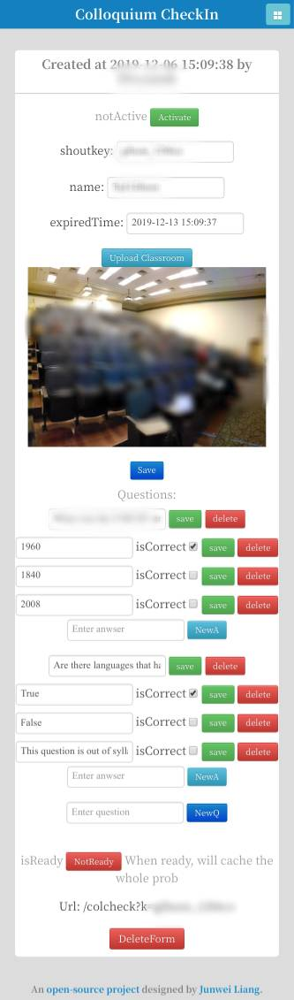

# Lecture Attendance Management System

This repository contains the code for a simple, efficient, mobile-usable web application of a lecture attendance management system. We have used this system within [CMU LTI](https://www.lti.cs.cmu.edu/) for a course with over a hundred students every semester since 2017.

## Introduction

### System Design Objectives

We have this course that has over a hundred students attending every semester. I was asked to build a system that could verify:
- Student attendance
- And that the students have payed attention to the lecture instead of doing their own stuff on the laptop

And it needs to be efficient for both the teaching assistants (TAs) and the students. Meaning that there is no need to create all student accounts beforehand, no need to manually take attendance for every student, etc.

### System Prerequisites
1. I assume every student has a unique ID. But since I also let students enter their full name, so we can still recover in the case where they misspell their ID.

2. That's it. This system is flexible for many course scenarios. And it supports multiple TA accounts.

### Summary of the System Workflow

1. ***Quiz Creation***. The teaching assistant (TA) creates an online questionnaire/quiz with multiple-choice questions about the lecture and a picture of the classroom and the students during the lecture. After the lecture ended, a *key (shoutkey)* is announced to the students by the TA.

3. ***Taking the Quiz***. Students then use the key to log on and answer the online questionnaire as well as pointing out where they were sitting at on the classroom picture.

4. ***Grading***. At the end of the semester, the TA can efficiently use the management system to look at student attendance rate, student quiz accuracy and even verify some students attendance with the classroom pictures.

### Step 1. Quiz Creation

The quiz creation interface is mobile-usable so that the TA doesn't have to bring a laptop to the class. Here are the lecture list interface and the quiz editing interface (click to see larger pictures).

  <!--These do not work on github markdown-->
  <!--

      
      
  
-->

  
  

## Installation & Usage
Instructions for installing and using the system on your local machine can be [found here](INSTALL.md).

## Code Overview
- `webapp` includes all the code needed for the web interface. It is written in PHP with Yii framework (v1.3), which I used in 2013 - 2015. There might be a lot of junk code. To find the code for a URL, for example, for "..index.php/application/cShowStats", the code is in webapp/protected/controllers/ApplicationController.php and in function "actionCShowStats". The view code is in webapp/themes/basic/views/application/cShowStats.php

To install the system on your machine you need to know basic usage of Apache server and MySQL database. To modify the web interface code, you will need to know PHP, Javascript with JQuery, html/css, and some knowledge of the Model/View/Controller (MVC) framework. I have tested the code on a CPU machine with Ubuntu 14.04.
